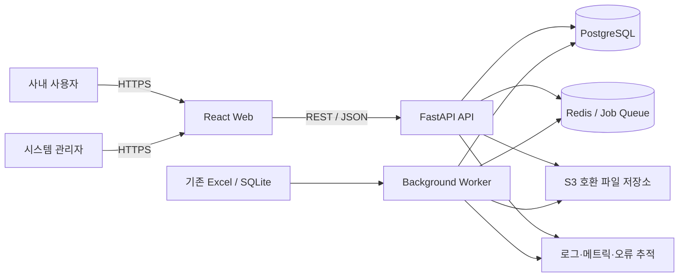
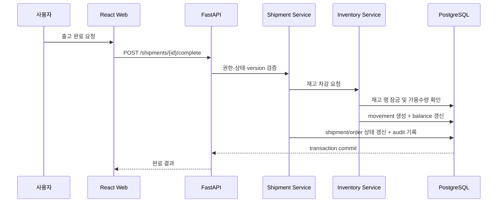
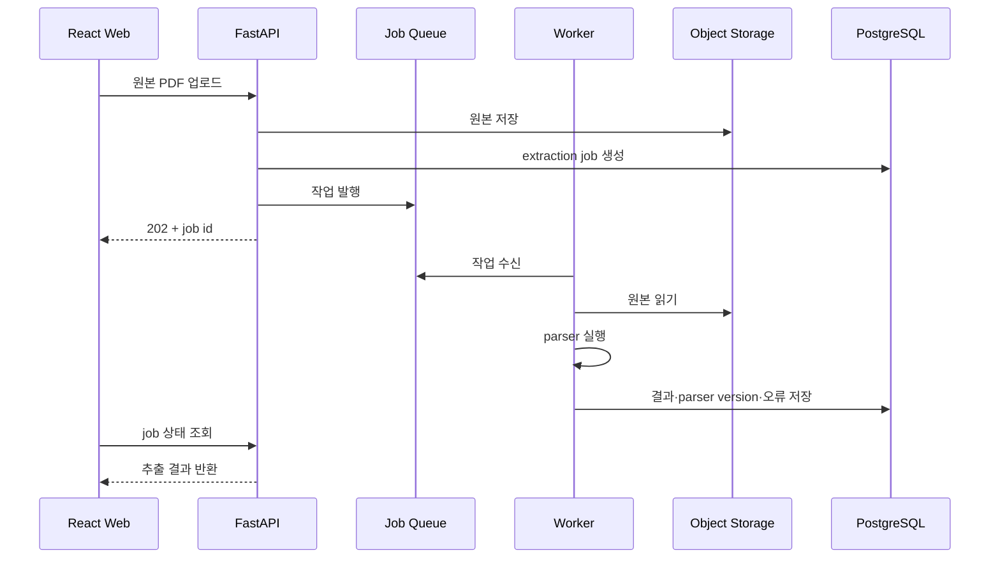
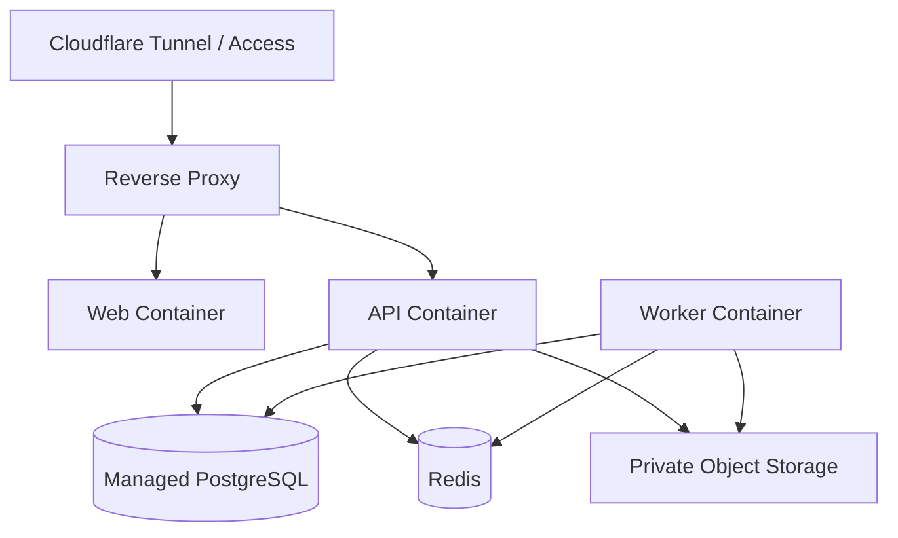

# MegaCell ERP 2.0 시스템 아키텍처 설계서

문서 버전: v0.1  
작성일: 2026-07-11  
목표 스택: FastAPI + React(TypeScript) + PostgreSQL

## 1. 목적

이 문서는 시스템의 구성 요소, 책임, 의존 방향, 데이터 흐름, 배포 구조와 기술적 제약을 정의한다. 개발 중 기능이 추가되더라도 시스템 경계가 무너지지 않았는지 확인하는 기준으로 사용한다.

## 2. 아키텍처 목표

- 수주, 생산, 구매, 재고, 출고, AS 도메인을 명확히 분리한다.
- PostgreSQL을 단일 업무 원장으로 사용한다.
- 프론트엔드와 백엔드는 명시적인 API 계약으로 통신한다.
- 느린 Excel/PDF/문서 작업을 웹 요청 처리와 분리한다.
- 인증, 권한, 감사, 로깅을 횡단 관심사로 일관되게 적용한다.
- 작은 팀이 운영할 수 있는 단순함을 유지하면서 향후 확장 경로를 확보한다.

## 3. 채택 구조

초기에는 **모듈러 모놀리스**를 채택한다.

- 하나의 FastAPI 애플리케이션 안에서 도메인 모듈을 분리한다.
- 도메인별 API, 서비스, 모델, repository를 구분한다.
- 도메인 간 직접 테이블 접근을 제한하고 공개 서비스 경계를 사용한다.
- 독립 확장이 필요한 작업 worker만 별도 프로세스로 운영한다.
- 운영 복잡도가 큰 마이크로서비스는 초기 도입하지 않는다.

## 4. 시스템 컨텍스트



Redis와 객체 스토리지는 해당 요구가 발생하는 시점에 활성화할 수 있다. 운영 초기라도 대용량 문서 파일을 PostgreSQL bytea에 저장하지 않는다.

## 5. 컨테이너와 책임

| 구성 요소 | 책임 | 금지 사항 |
|---|---|---|
| React Web | 화면, 입력, 클라이언트 상태, API 호출 | 업무 규칙의 최종 판정, DB 직접 접근 |
| FastAPI API | 인증, 권한, 업무 규칙, 트랜잭션, API 계약 | 장시간 Excel/PDF 작업 직접 수행 |
| Worker | 이관, PDF 추출, XLSM 생성, 대량 내보내기 | 사용자 권한을 무시한 임의 처리 |
| PostgreSQL | 업무 원장, 제약조건, 트랜잭션, 감사 메타데이터 | 원본 대용량 파일 저장 |
| Redis/Queue | 작업 큐, 짧은 캐시, 분산 lock | 영구 업무 원장 역할 |
| Object Storage | 첨부, 원본, 생성 문서, 버전 | 권한 검증 없는 공개 접근 |

## 6. 백엔드 계층

```text
HTTP Router
  → Application Service / Use Case
    → Domain Rules
      → Repository Interface
        → SQLAlchemy Repository
          → PostgreSQL
```

### 6.1 Router

- HTTP 입력 파싱과 response schema 반환
- 인증 사용자·요청 ID 전달
- HTTP status와 application error 매핑
- 업무 계산과 SQL 작성 금지

### 6.2 Application Service

- 하나의 use case 조정
- 권한 확인, 도메인 객체 호출, 트랜잭션 경계
- 다른 도메인 공개 서비스 호출
- 감사 이벤트 및 outbox event 생성

### 6.3 Domain

- 상태 전이, 수량·금액, 허용 조건 등 핵심 규칙
- FastAPI, SQLAlchemy, HTTP에 대한 의존 최소화
- 규칙 위반 시 의미 있는 domain error 반환

### 6.4 Repository

- 데이터 조회·저장 추상화
- 쿼리 최적화 및 동시성 제어
- 다른 도메인의 내부 테이블을 직접 수정하지 않음

## 7. 백엔드 모듈 구성

```text
ERP_Backend/app/
  main.py
  api/
    dependencies.py
    error_handlers.py
    v1/router.py
  core/
    config.py
    database.py
    security.py
    logging.py
    permissions.py
  domains/
    identity/
    master_data/
    sales/
    production/
    procurement/
    inventory/
    shipment/
    service/
    documents/
    imports/
    audit/
  integrations/
    object_storage/
    excel/
    pdf/
    notifications/
  workers/
  tests/
```

각 도메인 모듈의 권장 내부 구조:

```text
sales/
  api.py
  schemas.py
  models.py
  service.py
  repository.py
  errors.py
  permissions.py
  tests/
```

프로젝트 규모가 커질 때에만 `domain/`, `application/`, `infrastructure/` 하위 디렉터리로 추가 분리한다.

## 8. 프론트엔드 구조

```text
ERP_Front/src/
  app/
    router/
    providers/
    layouts/
  features/
    auth/
    sales-orders/
    production/
    procurement/
    inventory/
    shipments/
    service-cases/
    admin/
  components/
    ui/
    data-table/
    forms/
    feedback/
  lib/
    api/
    auth/
    formatting/
    validation/
  styles/
  tests/
```

의존 규칙:

- `app`은 feature를 조합한다.
- feature는 공통 `components`와 `lib`를 사용할 수 있다.
- 공통 컴포넌트는 특정 feature에 의존하지 않는다.
- feature 간 내부 모듈 직접 import를 피하고 공개 entry point를 사용한다.
- 서버 데이터는 TanStack Query, 화면 전용 로컬 상태는 React state를 우선한다.
- 서버 데이터를 전역 상태 store에 중복 보관하지 않는다.

## 9. 도메인 경계

| 도메인 | 소유 데이터 | 외부에 제공하는 주요 기능 |
|---|---|---|
| Identity | 사용자, 역할, 권한 | 인증 사용자, permission 확인 |
| Master Data | 고객, 공급업체, 제품, 자재, BOM | 기준정보 조회, 유효 BOM 제공 |
| Sales | 견적, 수주, 수주 품목 | 수주 확정, 변경, 미출고 계산 |
| Production | 생산 요청, 생산 지시, 진행 | 생산 접수·진행·완료 |
| Procurement | 구매 요청, 발주, 입고 | 발주·부분 입고 |
| Inventory | 재고 이동, 잔액, 예약 | 가용재고, 이동 생성, 예약 |
| Shipment | 출고 요청, 출고 | 피킹·출고 완료 |
| Service | AS 접수, 처리, 사용 부품 | AS 진행 및 종결 |
| Documents | 문서·템플릿·버전 | 추출, 생성, 다운로드 |
| Imports | 이관 작업, 오류, 매핑 | staging 검증과 반영 |
| Audit | 감사 로그 | 변경·접근 이력 조회 |

## 10. 핵심 데이터 흐름

### 10.1 출고 완료



중간 단계가 실패하면 전체 트랜잭션을 rollback한다. 동일 idempotency key의 재요청은 기존 결과를 반환한다.

### 10.2 문서 추출



추출 결과는 사용자가 확인한 뒤 업무 데이터로 확정한다.

## 11. 데이터베이스 설계 규칙

- 내부 기본키: UUID
- 업무번호: 별도 unique column
- 시각: `TIMESTAMPTZ`
- 금액: `NUMERIC(18,2)`
- 수량: 업무 단위에 맞는 `NUMERIC`, scale 명시
- 상태: PostgreSQL enum보다 code/check constraint 또는 애플리케이션 enum 우선
- 모든 업무 테이블: 생성·수정자, 시각, version 포함
- foreign key와 unique/check constraint 적극 활용
- 인덱스는 실제 필터·정렬·join 조건에 근거해 추가
- JSONB는 변경 가능한 부가 메타데이터에 제한하고 핵심 필드를 숨기지 않음
- 감사 로그에 비밀값과 대용량 파일 본문 저장 금지

### 11.1 트랜잭션

- application service의 use case 단위로 transaction을 연다.
- 외부 HTTP 호출을 DB transaction 안에서 오래 기다리지 않는다.
- 재고 차감 등 경합 영역은 `SELECT ... FOR UPDATE` 또는 동등한 제어를 사용한다.
- 이벤트 발행은 transactional outbox 패턴을 사용해 commit과 발행 불일치를 방지한다.

## 12. API 아키텍처

- REST JSON API, prefix `/api/v1`
- Pydantic request/response schema 분리
- OpenAPI에서 TypeScript client와 타입 생성
- pagination, filtering, sorting의 공통 규격 정의
- 오류 envelope 표준화
- version/ETag 기반 낙관적 잠금
- idempotency key 지원 대상: 출고 완료, 입고 완료, 이관 시작, 문서 생성

오류 예시:

```json
{
  "error": {
    "code": "INSUFFICIENT_STOCK",
    "message": "출고 가능한 재고가 부족합니다.",
    "field_errors": [],
    "correlation_id": "01J..."
  }
}
```

## 13. 인증·권한 구조

```text
요청
  → 인증 쿠키/토큰 검증
  → 현재 사용자 로드
  → endpoint permission 확인
  → 데이터 범위 정책 확인
  → use case 실행
```

- 자체 인증은 Argon2id 비밀번호 해시 사용
- 브라우저는 HttpOnly secure cookie 우선
- 향후 SSO 도입을 위해 사용자와 외부 identity provider 연결을 분리
- 권한 결과를 프론트엔드에 제공하되 최종 판단은 API가 수행
- 관리자 endpoint도 동일한 인증·감사 체계를 통과

## 14. 비동기 작업

다음 작업은 worker 대상으로 분류한다.

- Excel/SQLite 이관
- PDF 텍스트 추출
- XLSM/PDF 문서 생성
- 대량 내보내기
- 이메일·메신저 알림
- 무거운 통계 집계

작업 상태:

```text
queued → running → succeeded
                 → failed
                 → cancelled
```

모든 작업은 진행률, 생성자, 시작·종료 시각, 입력 참조, 결과 참조, 안전한 오류 메시지, 재시도 횟수를 기록한다.

## 15. 캐시 정책

- 정확성이 중요한 재고·금액·권한 결과를 장시간 캐시하지 않는다.
- React Query 캐시는 사용자 경험 개선용이며 mutation 성공 후 관련 key를 무효화한다.
- 서버 캐시는 기준정보나 비용이 큰 읽기 결과에만 TTL과 invalidation 정책을 명시해 사용한다.
- 캐시가 없어도 시스템이 정확하게 동작해야 한다.

## 16. 파일 저장 구조

- DB에는 파일 ID, 원본명, MIME, 크기, 해시, storage key, 버전, 생성자만 저장한다.
- 객체 스토리지는 private bucket을 사용한다.
- 다운로드는 API 권한 확인 후 짧은 만료 URL 또는 streaming으로 제공한다.
- storage key에 고객명이나 원본 파일명을 직접 사용하지 않는다.
- 동일 파일 탐지와 무결성 확인을 위해 해시를 저장한다.

## 17. 배포 아키텍처

### 17.1 환경

- local: Docker Compose
- staging: 운영과 유사한 분리 환경
- production: 컨테이너 기반 배포, 관리형 PostgreSQL 권장

### 17.2 초기 운영 구성



Cloudflare Access는 외곽 접근 보호로 사용할 수 있지만 앱 내부 인증·권한을 대체하지 않는다.

## 18. CI/CD

```text
Pull Request
  → backend lint/type/test
  → frontend lint/type/test
  → migration safety check
  → build
  → staging deploy
  → smoke/E2E
  → production approval
  → production deploy
  → post-deploy smoke test
```

마이그레이션은 backward-compatible한 expand/contract 전략을 우선한다. 위험한 컬럼 삭제와 타입 변경은 여러 배포로 나눈다.

## 19. 관측성과 운영

- JSON 구조화 로그
- request/correlation ID
- API latency, error rate, DB pool, queue depth, job failure 메트릭
- 오류 추적 도구에 release version 연결
- 감사 로그와 기술 로그 분리
- health endpoint: liveness와 readiness 분리
- 사용자 화면 또는 관리자 화면에 배포 버전과 작업 실패 현황 제공

## 20. 백업과 복구

- PostgreSQL 자동 백업과 복구 시점 정책 수립
- 객체 스토리지 버전 또는 보존 정책 적용
- 설정과 secret의 복구 절차 문서화
- 정기 복구 훈련 수행
- 초기 목표: RPO 24시간 이하, RTO 4시간 이하
- 장애 복구 시 DB와 파일 메타데이터 시점 일치 여부 확인

## 21. 레거시 전환 구조

```text
ERP_Backend/legacy/streamlit
  ├─ 병행 운영 기간 조회 전용
  └─ 신규 PostgreSQL API 직접 쓰기 금지

ERP_Backend workers (imports)
  ├─ Excel/SQLite raw 수집
  ├─ staging 검증
  ├─ mapping 및 대사
  └─ domain table 반영
```

도메인별 cutover 후 해당 데이터의 쓰기 주체는 신규 ERP 하나로 제한한다.

## 22. 아키텍처 의사결정 기록

중요 기술 결정은 `docs/adr/NNNN-title.md`로 기록한다.

ADR 필수 항목:

- 상태: proposed / accepted / deprecated / superseded
- 맥락
- 결정
- 대안
- 결과와 trade-off
- 적용일과 결정자

초기 ADR 후보:

1. 모듈러 모놀리스 채택
2. 인증 쿠키와 SSO 확장 방식
3. 재고 원장 및 balance 구조
4. background job 도구 선정
5. 파일 저장소 선정
6. Excel cutover 전략

## 23. 아키텍처 리뷰 체크리스트

### 경계

- [ ] 기능이 올바른 도메인에 위치하는가?
- [ ] 다른 도메인 테이블을 직접 수정하지 않는가?
- [ ] router나 React 컴포넌트에 업무 규칙이 들어가지 않았는가?
- [ ] 공통 모듈이 특정 도메인 코드에 의존하지 않는가?

### 데이터

- [ ] PostgreSQL 제약조건으로 핵심 무결성을 보호하는가?
- [ ] transaction 경계가 use case와 일치하는가?
- [ ] 동시성·중복 요청·재시도를 고려했는가?
- [ ] migration과 rollback/roll-forward 경로가 있는가?

### 운영

- [ ] 장시간 작업이 worker로 분리되었는가?
- [ ] 로그, 메트릭, correlation ID가 있는가?
- [ ] 외부 연동 실패가 핵심 transaction을 불명확하게 만들지 않는가?
- [ ] 백업·복구와 장애 진단이 가능한가?

### 보안

- [ ] 인증·permission·데이터 범위 검사가 적용되는가?
- [ ] 파일과 비밀정보가 안전한 저장소에 있는가?
- [ ] 감사 대상 작업을 기록하는가?
- [ ] 프론트엔드 번들에 secret이 포함되지 않는가?

## 24. 금지되는 구조

- React에서 DB 또는 사내 파일 경로 직접 접근
- router에서 SQL 실행과 핵심 업무 계산
- 하나의 거대한 service/repository 파일에 모든 도메인 구현
- 다른 도메인 테이블을 직접 UPDATE해 상태 동기화
- Redis를 영구 원장으로 사용
- Excel과 PostgreSQL 양방향 동기화를 기본 구조로 사용
- 요청 처리 중 대용량 PDF·Excel 작업을 동기 실행
- 운영 DB에 수동 DDL 적용
- 인증 없이 접근 가능한 파일 URL 영구 제공

